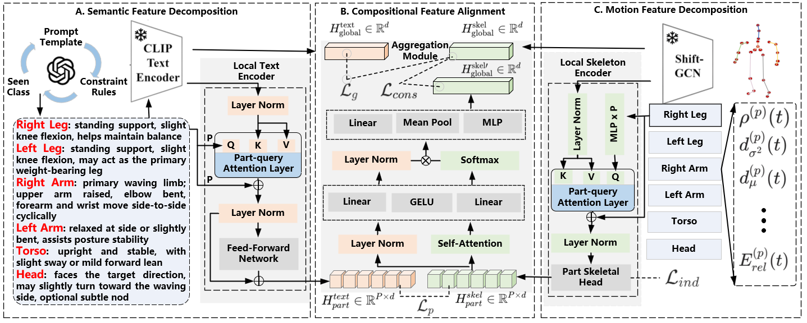

# Generalized Zero-Shot Skeleton Action Recognition

<p align="center">
  
  
  
</p>

<p align="center">
  
</p>
<p align="center"><b>Figure 2.</b> Overview of the proposed framework.</p>

This is a PyTorch implementation of the paper:

> **Generalized Zero-Shot Skeleton Action Recognition with Compositional Motion-Attribute Primitives**  
> *Jinlong Wang, Xuan Liu, Bin Lyu, Jinchao Ge, Jiahui Yu*  
> Pattern Recognition, 2025

<p align="center">
  <a href="#overview">Overview</a> •
  <a href="#installation">Installation</a> •
  <a href="#quick-start">Quick Start</a> •
  <a href="#project-structure">Structure</a> •
  <a href="#citation">Citation</a>
</p>

---

## Overview

This project implements a compositional framework for **Generalized Zero-Shot (GZS) skeleton-based action recognition** that learns reusable body-part motion primitives and aligns them with structured textual semantics.

---

## Installation

### Prerequisites

- Python 3.8+
- PyTorch 2.0+
- CUDA 11.0+ (for GPU support)

### Setup

```bash
# Clone the repository
git clone https://github.com/your-username/GZSL.git
cd GZSL

# Create virtual environment
python -m venv venv
source venv/bin/activate  # Linux/Mac
# venv\Scripts\activate   # Windows

# Install dependencies
pip install -r requirements.txt

# Download CLIP weights (automatically done on first run)
```

### Requirements

```
torch>=2.0.0
torchvision
numpy
tqdm
pyyaml
scikit-learn
transformers
```

---

## Quick Start

### 1. Generate Text Prompts

Generate part-level textual descriptions for action classes:

```bash
python scripts/generate_prompts.py --dataset ntu60 --output data/prompts/
```

### 2. Train the Model

```bash
python scripts/train.py --config config/config.yaml
```

### 3. Test the Model

```bash
python scripts/test.py --checkpoint checkpoints/best_model.pth --dataset ntu60
```

---

## Project Structure

```
GZSL/
├── config/
│   └── config.py              # Configuration settings
├── data/
│   ├── __init__.py
│   ├── dataset.py             # Dataset loaders (NTU60/120, PKU-MMD, UCF101, HMDB-51)
│   ├── motion_attribute.py    # Motion attribute computation (Section 3.1)
│   └── few_shot.py            # Few-shot learning support
├── models/
│   ├── __init__.py
│   ├── text_encoder.py        # CLIP + Local Text Encoder
│   ├── skeleton_encoder.py    # Shift-GCN + Local Skeleton Encoder
│   ├── aggregation.py         # Primitive composition & losses (Section 3.3)
│   └── gzsl_model.py          # Main GZSL model (Section 3.4)
├── utils/
│   ├── __init__.py
│   └── metrics.py             # GZSL evaluation metrics
├── scripts/
│   ├── train.py               # Training script
│   ├── test.py                # Testing script
│   └── generate_prompts.py   # LLM prompt generation
├── clip/                      # CLIP model weights
├── requirements.txt
├── README.md
└── __init__.py
```

---

## Training

### Configuration

Edit `config/config.yaml` to customize training:

```yaml
dataset:
  name: ntu60
  data_dir: data/ntu60/

training:
  batch_size: 32
  num_epochs: 100
  learning_rate: 0.001
  weight_decay: 0.0001

model:
  feature_dim: 256
  num_parts: 6
  lambda_p: 1.0
  lambda_g: 1.0
  lambda_c: 0.5
  lambda_i: 0.3
```

### Expected Results

| Dataset | Acc_s | Acc_u | HM |
|---------|-------|-------|-----|
| NTU60 | ~85% | ~65% | ~73% |
| NTU120 | ~82% | ~60% | ~69% |
| UCF101 | ~78% | ~55% | ~64% |
| PKU-MMD | ~80% | ~58% | ~67% |

---

## Few-shot Evaluation

Evaluate on unseen classes with K-shot:

```bash
python scripts/test.py --checkpoint checkpoints/best_model.pth \
    --dataset hmdb51 --few-shot --num-shots 16 --num-way 5
```

---

## Citation

If you use this code in your research, please cite:

```bibtex
@article{wang2025generalized,
  title={Generalized Zero-Shot Skeleton Action Recognition with Compositional Motion-Attribute Primitives},
  author={Wang, Jinlong and Liu, Xuan and Lyu, Bin and Ge, Jinchao and Yu, Jiahui},
  journal={Pattern Recognition},
  year={2025}
}
```

---

## License

This project is licensed under the MIT License.

---

## Acknowledgments

- [Shift-GCN](https://github.com/liu-zhy/Shift-GCN) for skeleton encoding
- [CLIP](https://github.com/openai/CLIP) for text encoder
