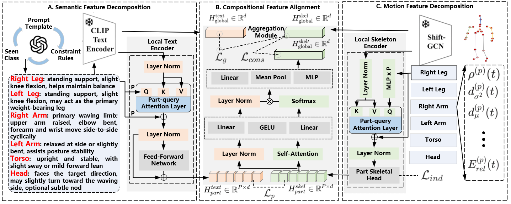

# Generalized Zero-Shot Skeleton Action Recognition

<p align="center">
  
  
  
</p>

<p align="center">
  
</p>
<p align="center"><b>Figure 2.</b> Overview of the proposed framework.</p>

This is a PyTorch implementation of the paper:

> **Generalized Zero-Shot Skeleton Action Recognition with Compositional Motion-Attribute Primitives**
> *Jinlong Wang, Xuan Liu, Bin Lyu, Jinchao Ge, Jiahui Yu*
> Pattern Recognition, 2025

<p align="center">
  <a href="#overview">Overview</a> •
  <a href="#installation">Installation</a> •
  <a href="#quick-start">Quick Start</a> •
  <a href="#reproducibility-materials">Reproducibility</a> •
  <a href="#project-structure">Structure</a> •
  <a href="#citation">Citation</a>
</p>

---

## Overview

This project implements a compositional framework for **Generalized Zero-Shot (GZS) skeleton-based action recognition** that learns reusable body-part motion primitives and aligns them with structured textual semantics.

---

## Installation

### Prerequisites

- Python 3.8+
- PyTorch 2.0+
- CUDA 11.0+ (for GPU support)

### Setup

```bash
# Clone the repository
git clone <repository-url>
cd gzsl-skeleton

# Create virtual environment
python -m venv venv
source venv/bin/activate  # Linux/Mac
# venv\Scripts\activate   # Windows

# Install dependencies
pip install -r requirements.txt

# Download CLIP weights (automatically done on first run)
```

### Requirements

```
torch>=2.0.0
torchvision
numpy
tqdm
pyyaml
scikit-learn
transformers
```

---

## Quick Start

### 1. Rebuild Released Split Files

```bash
python scripts/build_reproducibility_assets.py
```

### 2. Train the Model

```bash
python scripts/train.py --config config/config.yaml
```

### 3. Test the Model

```bash
python scripts/test.py --checkpoint checkpoints/best_model.pth --dataset ntu60
```

---

## Project Structure

```
GZSL/
├── config/
│   └── config.yaml            # Configuration settings
├── data/
│   ├── __init__.py
│   ├── dataset.py             # Dataset loaders (NTU60/120, PKU-MMD, UCF101, HMDB-51)
│   ├── motion_attribute.py    # Motion attribute computation (Section 3.1)
│   └── few_shot.py            # Few-shot learning support
├── models/
│   ├── __init__.py
│   ├── text_encoder.py        # CLIP + Local Text Encoder
│   ├── skeleton_encoder.py    # Shift-GCN + Local Skeleton Encoder
│   ├── aggregation.py         # Primitive composition & losses (Section 3.3)
│   └── gzsl_model.py          # Main GZSL model (Section 3.4)
├── utils/
│   ├── __init__.py
│   └── metrics.py             # GZSL evaluation metrics
├── scripts/
│   ├── train.py               # Training script
│   ├── test.py                # Testing script
│   └── generate_prompts.py   # Prompt and text-feature utilities
├── clip/                      # CLIP model weights
├── requirements.txt
├── README.md
└── __init__.py
```

---

## Reproducibility Materials

This repository includes the reproducibility materials for the paper:

- `prompts/prompt_template.md`: exact prompt template for body-part descriptions.
- `data/prompts/{ntu60,ntu120,ucf101,pku_mmd,hmdb51}.json`: minimal JSON arrays containing each `action_class` and its generated head, torso, left/right arm, and left/right leg descriptions.
- `data/prompts/appendix_a_examples.json`: representative generated examples synchronized with Appendix A Table 6.
- `data/splits/<dataset>/*.json` and `.csv`: explicit seen/unseen class partitions for the random and provided protocols.
- `scripts/preprocess_skeletons.py`: preprocessing entry point for raw NTU/PKU skeleton files, generic NPZ skeletons, COCO/OpenPose-style 2D pose JSON, motion-attribute extraction, and normalization.

See `docs/reproducibility_materials.md` for file-format notes and `docs/appendix_a_supplementary.md` for the Appendix A diagnostic tables and settings.

---

## Training

### Expected Results

| Dataset | Split | Acc_s | Acc_u | HM |
|---------|-------|------:|------:|---:|
| NTU60 | 3-split random, 55/5 | 78.5 | 81.2 | 79.8 |
| NTU120 | 3-split random, 110/10 | 63.4 | 77.6 | 69.9 |
| UCF101 | 3-split random, 80/21 | 96.1 | 83.7 | 89.5 |
| UCF101 | 3-split provided, 80/21 | 95.6 | 84.0 | 89.4 |
| PKU-MMD | 3-split random, 46/5 | 70.8 | 62.0 | 66.1 |
| PKU-MMD | 3-split provided, 46/5 | 76.8 | 63.9 | 69.8 |

---

## Few-shot Evaluation

Evaluate on unseen classes with K-shot:

```bash
python scripts/test.py --checkpoint checkpoints/best_model.pth \
    --dataset hmdb51 --few-shot --num-shots 16 --num-way 5
```

---

## Citation

If you use this code in your research, please cite:

```bibtex
@article{wang2025generalized,
  title={Generalized Zero-Shot Skeleton Action Recognition with Compositional Motion-Attribute Primitives},
  author={Wang, Jinlong and Liu, Xuan and Lyu, Bin and Ge, Jinchao and Yu, Jiahui},
  journal={Pattern Recognition},
  year={2025}
}
```

---

## License

This project is licensed under the MIT License.

---

## Acknowledgments

- [Shift-GCN](https://github.com/liu-zhy/Shift-GCN) for skeleton encoding
- [CLIP](https://github.com/openai/CLIP) for text encoder
